> 太硬了！！！

# 给阿里巴巴Fastjson修bug

[视频链接](https://www.bilibili.com/video/av77302131)

#### 找bug标准

1. bug能复现
2. bug比较重要


找到的bug：（已提供可复现的源码，求fix）fastjson无法反序列化超出某种限制的类[bug链接](https://github.com/alibaba/fastjson/issues/2779)

首先从GitHub上面clone fastjson项目，在idea中打开

之间从GitHub上面下载项目太慢了，可以注册个码云账号，绑定GitHub账号，然后可以从GitHub中导入仓库到码云中，在码云中下载速度飞快呀！

打开项目，进入test包

创建一个和他给的源码一样的Java类

在GitHub中，点raw然后复制

他源码中使用了Lombok，Lombok是不用添加getter和setter，我们先删掉，然后自己手动添加getter和setter

创建测试类。。。测试成功，哈哈哈，我下载了一个已经修复了bug的版本

没事，虽然修复了，我还是可以跟着学习其中的技术

bug出在这里的第87行

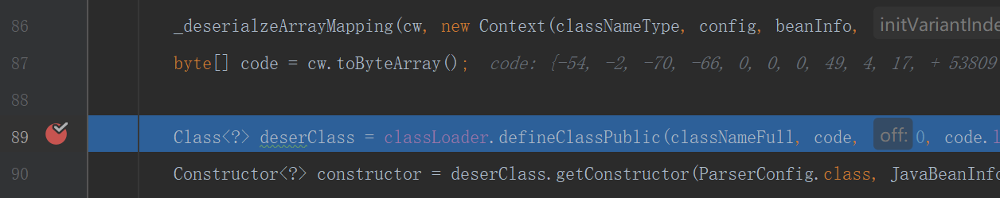

我们在其下一行打断点，进行调试，查看code变量

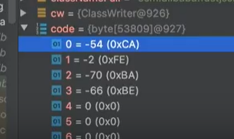

> 声明：Java 字节码 magic number 就是CAFE BABE
>
> Java有咖啡的意思

#### Evaluate Expression表达式求值

在code出右键有个Evaluate Expression，表达式求值

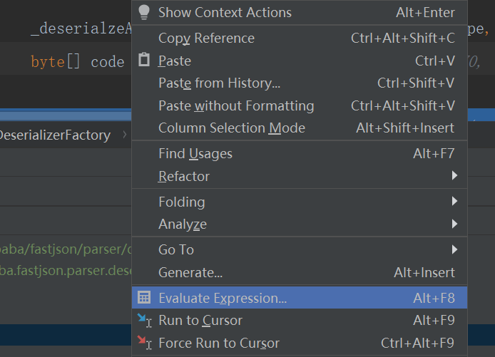

将其字节码输出到文件bad.class

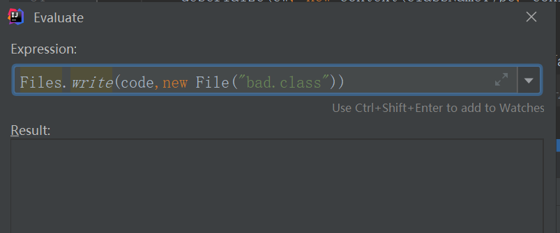

windows下的展示当前目录文件是dir命令

可以看到当前项目下生成了bad.class  当然，这个问题已经修复了，这个class文件是好的😂  idea可以反编译

如果是坏的，idea无法反编译，会出现下面的结果

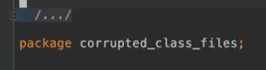

我们先假装他是坏的，用一些工具来查看这个坏的字节码文件

例如下面的命令

```shell
javap -v bad #Java自带的反编译工具
```

但是太长了，在命令行看也不太方便

我们使用下面的工具classpy

#### 反编译工具classpy

在GitHub搜索classpy，clone下来，按照readme安装运行

我是Windows系统，首先进入classpy目录下，点击运行了gradlew.bat文件，然后输入下面的命令启动这个工具

```shell
./gradlew run 
```


视频中他的Java版本为11，启动失败了

使用了jenv命令切换jdk

```shell
jenv shell 1.8  #需要安装jenv
```


下面是打开的字节码文件

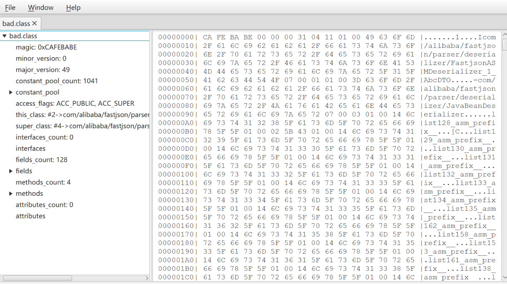


由于我们只有Illegal target of jump or branch这个报错信息，这一个线索

到jdk中寻找此报错信息。。。硬核啊  然后他修改了jdk，重新build了一个jdk，用自己build的jdk运行之前的字节码


先算了，明天再继续写吧 视频进度条19:12


12/8更新

随后找到deserialize方法  字节码  第50个位置是这样的

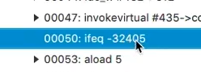

```
ifeq -32405 
```

溢出


我这里是修复好的啦，长这样

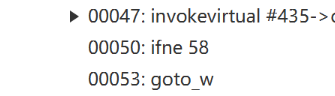

然后根据上下文，在源码中找到相应位置

视频中的

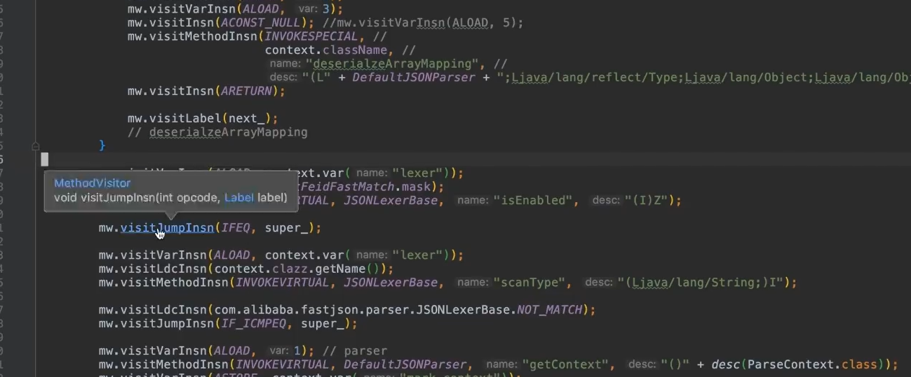

我的

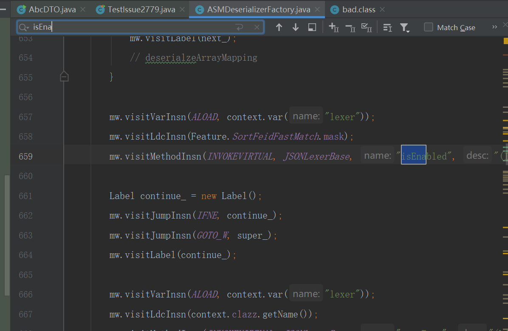


最后解决的问题：按照asm的要求，把一个不支持长跳转的ifeq转变成ifnq加goto_w长跳转语句


修完bug一定要补一个测试用例！


#### 字节码的解释：

简单写一个测试一下

```Java
public class AbcDTO {
    public static void main(String [] args) {
        int i =1,j=2;
        if (i+j==3){
            System.out.println("3");
        }else {
            System.out.println("0");
        }
    }
```

编译运行，使用ASM Bytecode Viewer插件查看字节码

#### ASM Bytecode Viewer插件

可在idea Plugins中安装

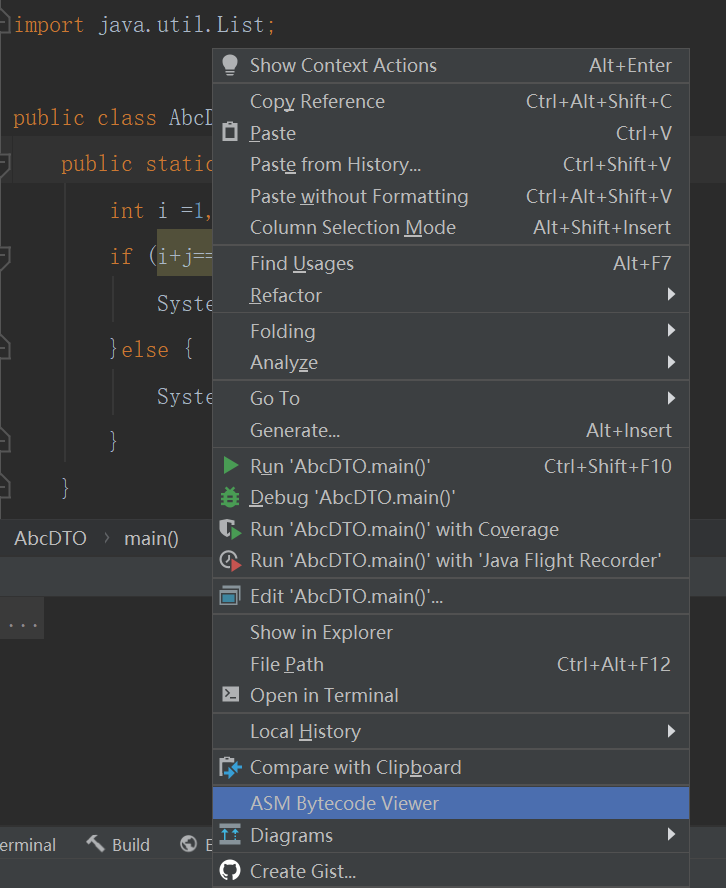

找到main方法

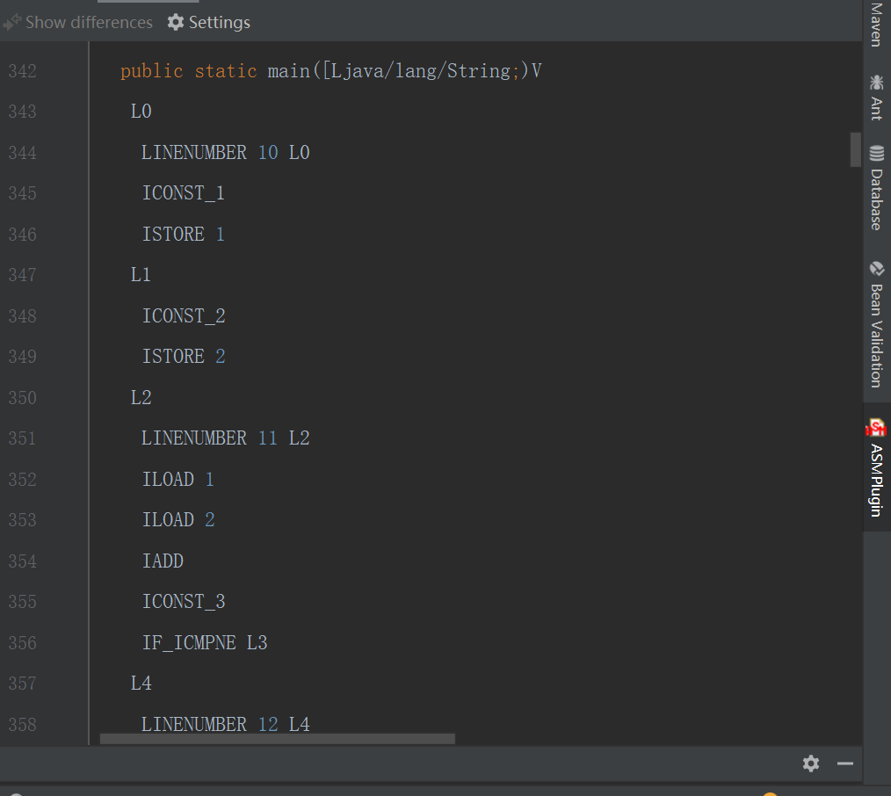

每个方法里面有个操作数栈，jvm执行方法时会不停的执行这些指令


#### 修bug要掌握的东西

1. 重现bug
2. 字节码


R大的书单RednaxelaFX


#### mybatis

1. #{} ${}
2. 缓存是咋实现的？
3. Executor是啥？
4. 分页是怎么实现的？